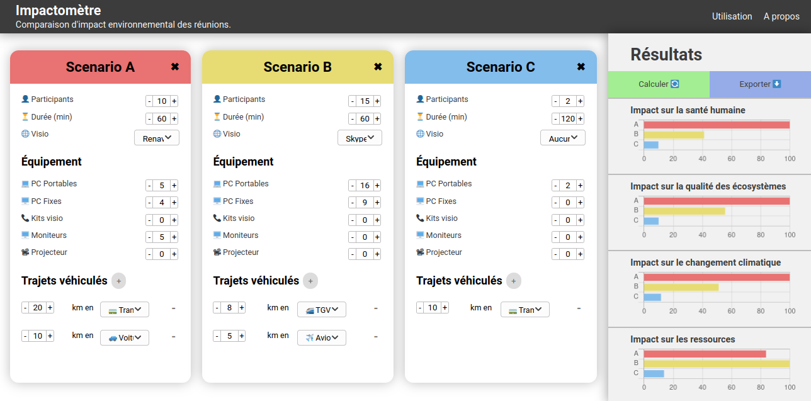
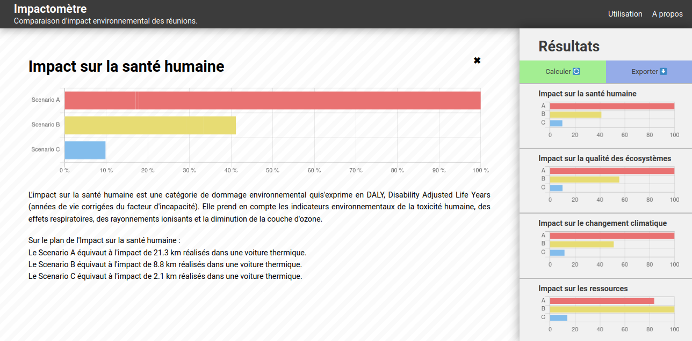

# impactometre-front
Frontend du projet `impactometre.fr`, comparateur d'impact environnemental des réunions.

**Application** : https://impactometre.fr

_This program is free software: you can redistribute it and/or modify
it under the terms of the GNU General Public License as published by
the Free Software Foundation, either version 3 of the License, or
(at your option) any later version._

_This program is distributed in the hope that it will be useful,
but WITHOUT ANY WARRANTY; without even the implied warranty of
MERCHANTABILITY or FITNESS FOR A PARTICULAR PURPOSE.  See the
GNU General Public License for more details._

## Description

Cette application basée sur `VueJS` permet de comparer l'impact environnemental de trois différents scénarios de réunions, pour différentes sphères de dommage : impact sur la santé humaine, sur la qualité des écosystèmes, sur le changement climatique et sur les ressources.

Les résultats sont présentés sous forme de pourcentage, par rapport à celui ayant le plus d'impact.

L'application est construite sur l'API [impactometre-back](https://github.com/impactometre/impactometre-back).

_🇬🇧 This VueJS-based application allows to compare the environmental impact of up to three meeting scenarios of your choice, for different spheres of damage: impact on human health, on ecosystem quality, on climate change and on resources. The results are relative: the value of the impact in each sphere is displayed as a percentage of the value for the scenario with the highest impact. The application was built as an interface for the [impactometre-back](https://github.com/impactometre/impactometre-back) API._

## Captures d'écran





## Pour développer ou héberger le projet

### Installer Node.js et npm
https://nodejs.org/

### Installer les dépendances
```bash
$ npm install
```

### 🛠 dev : Lancer le serveur de développement
Cette commande permet de démarrer un serveur de développement (webpack) avec remplacement des modules à chaud.
```bash
$ npm run serve
```

### ✨ prod : Déployer en production
Cette commande génère l'application sous la forme d'un bundle statique prêt à être déployé, dans le répertoire `/dist`.
Il suffit ensuite de la déployer en utilisant un serveur web comme [nginx](https://cli.vuejs.org/guide/deployment.html#docker-nginx).
```bash
$ npm run build
```
