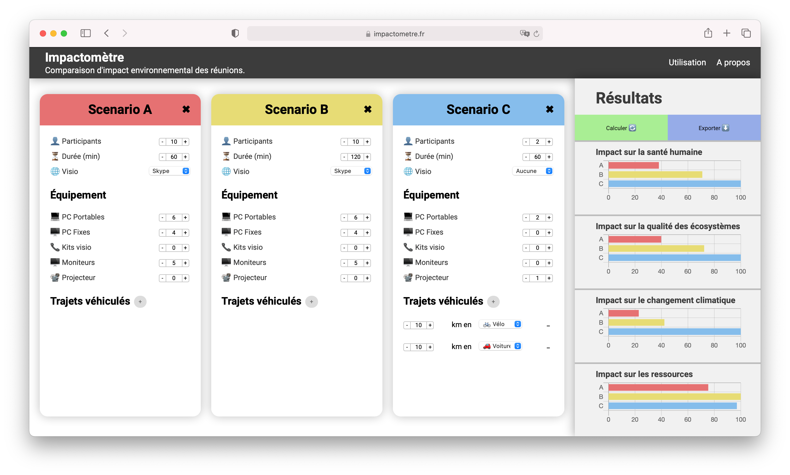

# impactometre-front
Frontend du projet `impactometre.fr`, comparateur d'impact environnemental des réunions.

**Application** : https://impactometre.fr

_This program is free software: you can redistribute it and/or modify
it under the terms of the GNU General Public License as published by
the Free Software Foundation, either version 3 of the License, or
(at your option) any later version._

_This program is distributed in the hope that it will be useful,
but WITHOUT ANY WARRANTY; without even the implied warranty of
MERCHANTABILITY or FITNESS FOR A PARTICULAR PURPOSE.  See the
GNU General Public License for more details._

## Description

_This VueJS-based application allows the user to compare the environmental impact of three different meeting scenarios, for different spheres of damage: impact on human health, on ecosystem quality, on climate change and on resources._

_The results are presented as a percentage, based on the one with the greatest impact._

Cette application basée sur `VueJS` permet de comparer l'impact environnemental de trois différents scénarios de réunions, pour différentes sphères de dommage : impact sur la santé humaine, sur la qualité des écosystèmes, sur le changement climatique et sur les ressources.

Les résultats sont présentés sous forme de pourcentage, par rapport à celui ayant le plus d'impact.

L'application est construite sur l'API [impactometre-back](https://github.com/impactometre/impactometre-back).

## Captures d'écran




## Pour développer

### Installer Node.js et npm
Avec Linux :
```bash
$ curl -sL https://deb.nodesource.com/setup_12.x | sudo -E bash -
$ sudo apt-get install -y nodejs
```
Avec Windows : [télécharger le .msi](https://nodejs.org/dist/v12.14.0/node-v12.14.0-x86.msi)

### Installer Vue CLI
```bash
npm install -g @vue/cli
```
### Pour lancer le front en mode serve
```bash
# Installer les dépendances
$ npm install
# Lancer le projet
$ npm run serve
```

### Pour lancer le front en mode build (génération de fichiers statique)
```bash
# Installer les dépendances
$ npm install
# Lancer le projet
$ npm run build
```
